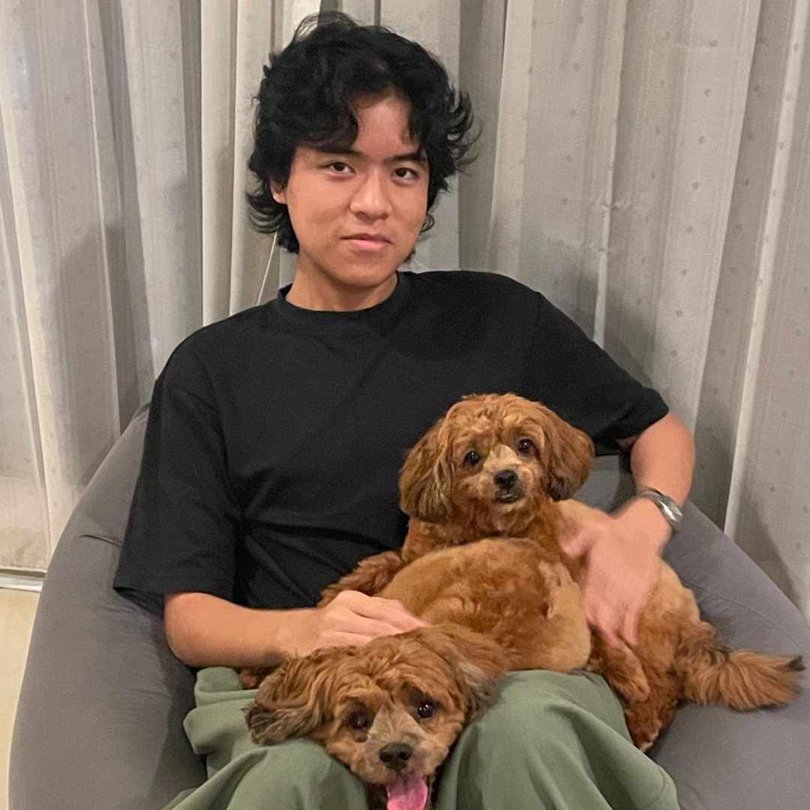
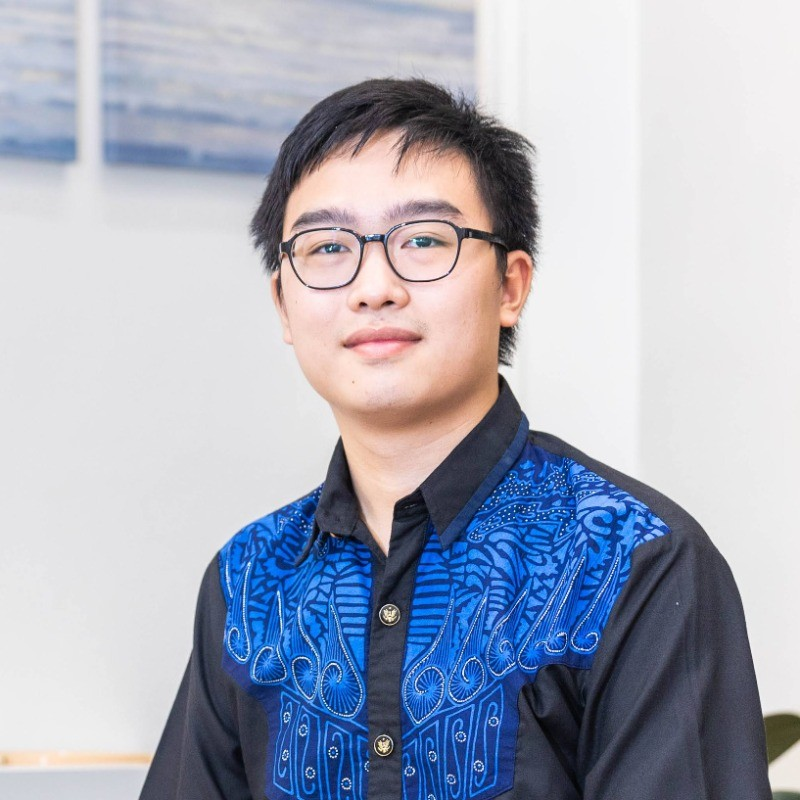
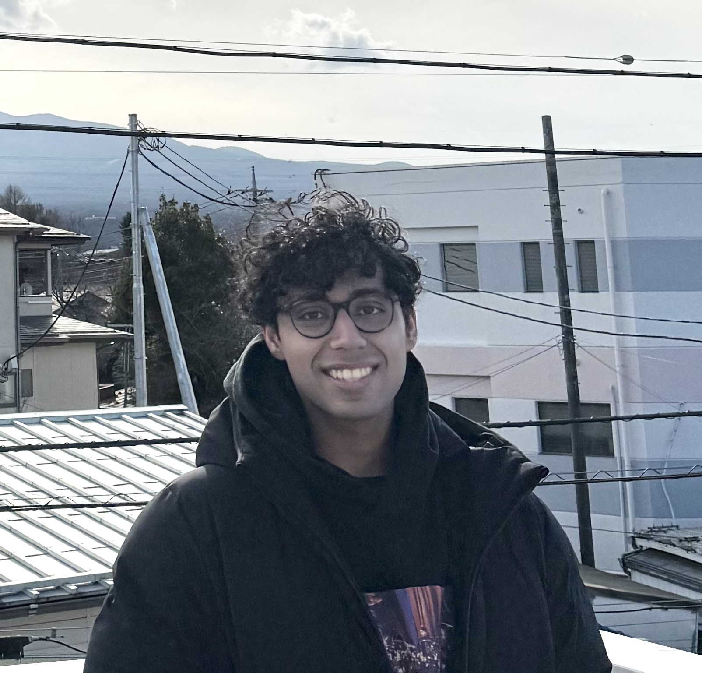

We are CS2103T-T11 Team 1, a team based in the [School of Computing, National University of Singapore](https://www.comp.nus.edu.sg).

## Project team

### Abi Halim

[[github](https://github.com/AbiHalim)]

* Role: Team Lead
* In charge of Documentation

### Vee Hua Zhi

* Role: Code Quality
* In charge of ensuring Code Quality

### Shashwat Chandra

[[github](http://github.com/shashwatchan)]
[[website](http://shashwatchandra.com)]

* Role: PM
* Responsibilities: Testing

### Song Yuexi

[[github](https://github.com/YosieSYX)]
[[portfolio](https://yosiesyx.github.io/SongYuexi/)]

* Role: Testing, Scheduling and tracking
* Responsibilities: In charge of defining, assigning, and tracking project tasks, Ensures the testing of the project is done properly and on time.

