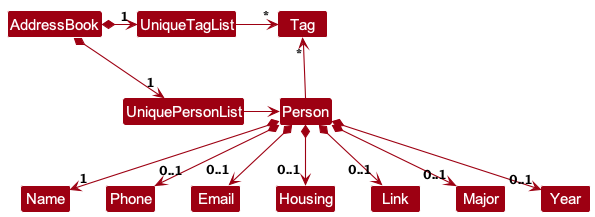

# Developer Guide
{: .no_toc}

## Table of Contents
{: .no_toc .text-delta }

* Table of Contents
{:toc}

--------------------------------------------------------------------------------------------------------------------

## **Acknowledgements**

* It is based on the [AddressBook-Level3 (AB3) project](https://github.com/se-edu/addressbook-level3) created by the [SE-EDU initiative](https://se-education.org).
In addition to the functionalities provided in AB3, we introduce features that can help NUS students better manage their contacts' information.

--------------------------------------------------------------------------------------------------------------------

## **Setting up, getting started**

Refer to the guide [_Setting up and getting started_](SettingUp.md).

--------------------------------------------------------------------------------------------------------------------

## **Design**

{: .tip }
> The `.puml` files used to create diagrams in this document `docs/diagrams` folder. Refer to the [_PlantUML Tutorial_ at se-edu/guides](https://se-education.org/guides/tutorials/plantUml.html) to learn how to create and edit diagrams.

### Architecture

The ***Architecture Diagram*** given above explains the high-level design of the App.

Given below is a quick overview of main components and how they interact with each other.

**Main components of the architecture**

**`Main`** (consisting of classes [`Main`](https://github.com/{{site.repository}}/tree/master/src/main/java/seedu/address/Main.java) and [`MainApp`](https://github.com/{{site.repository}}/tree/master/src/main/java/seedu/address/MainApp.java)) is in charge of the app launch and shut down.
* At app launch, it initializes the other components in the correct sequence, and connects them up with each other.
* At shut down, it shuts down the other components and invokes cleanup methods where necessary.

The bulk of the app's work is done by the following four components:

* [**`UI`**](#ui-component): The UI of the App.
* [**`Logic`**](#logic-component): The command executor.
* [**`Model`**](#model-component): Holds the data of the App in memory.
* [**`Storage`**](#storage-component): Reads data from, and writes data to, the hard disk.

[**`Commons`**](#common-classes) represents a collection of classes used by multiple other components.

**How the architecture components interact with each other**

The *Sequence Diagram* below shows how the components interact with each other for the scenario where the user issues the command `delete 1`.

Each of the four main components (also shown in the diagram above),

* defines its *API* in an `interface` with the same name as the Component.
* implements its functionality using a concrete `{Component Name}Manager` class (which follows the corresponding API `interface` mentioned in the previous point.

For example, the `Logic` component defines its API in the `Logic.java` interface and implements its functionality using the `LogicManager.java` class which follows the `Logic` interface. Other components interact with a given component through its interface rather than the concrete class (reason: to prevent outside component's being coupled to the implementation of a component), as illustrated in the (partial) class diagram below.

The sections below give more details of each component.

### UI component

The **API** of this component is specified in [`Ui.java`](https://github.com/{{site.repository}}/tree/master/src/main/java/seedu/address/ui/Ui.java)

The UI consists of a `MainWindow` that is made up of parts e.g.`CommandBox`, `ResultDisplay`, `PersonListPanel`, `StatusBarFooter` etc. All these, including the `MainWindow`, inherit from the abstract `UiPart` class which captures the commonalities between classes that represent parts of the visible GUI.

The `UI` component uses the JavaFx UI framework. The layout of these UI parts are defined in matching `.fxml` files that are in the `src/main/resources/view` folder. For example, the layout of the [`MainWindow`](https://github.com/{{site.repository}}/tree/master/src/main/java/seedu/address/ui/MainWindow.java) is specified in [`MainWindow.fxml`](https://github.com/{{site.repository}}/tree/master/src/main/resources/view/MainWindow.fxml)

The `UI` component,

* executes user commands using the `Logic` component.
* listens for changes to `Model` data so that the UI can be updated with the modified data.
* keeps a reference to the `Logic` component, because the `UI` relies on the `Logic` to execute commands.
* depends on some classes in the `Model` component, as it displays `Person` object residing in the `Model`.

### Logic component

**API** : [`Logic.java`](https://github.com/{{site.repository}}/tree/master/src/main/java/seedu/address/logic/Logic.java)

Here's a (partial) class diagram of the `Logic` component:

The sequence diagram below illustrates the interactions within the `Logic` component, taking `execute("delete 1")` API call as an example.

{: .note }
> The lifeline for `DeleteCommandParser` should end at the destroy marker (X) but due to a limitation of PlantUML, the lifeline continues till the end of diagram.

How the `Logic` component works:

1. When `Logic` is called upon to execute a command, it is passed to an `AddressBookParser` object which in turn creates a parser that matches the command (e.g., `EditCommandParser`) and uses it to parse the command.
1. This results in a `Command` object (more precisely, an object of one of its subclasses e.g., `EditCommand`) which is executed by the `LogicManager`.
1. The command can communicate with the `Model` when it is executed (e.g. to edit a person). 
   Note that although this is shown as a single step in the diagram above (for simplicity), in the code it can take several interactions (between the command object and the `Model`) to achieve.
1. The result of the command execution is encapsulated as a `CommandResult` object which is returned back from `Logic`.

Here are the other classes in `Logic` (omitted from the class diagram above) that are used for parsing a user command:

How the parsing works:
* When called upon to parse a user command, the `AddressBookParser` class creates an `XYZCommandParser` (`XYZ` is a placeholder for the specific command name e.g., `AddCommandParser`) which uses the other classes shown above to parse the user command and create a `XYZCommand` object (e.g., `AddCommand`) which the `AddressBookParser` returns back as a `Command` object.
* All `XYZCommandParser` classes (e.g., `AddCommandParser`, `DeleteCommandParser`, ...) inherit from the `Parser` interface so that they can be treated similarly where possible e.g, during testing.

### Model component
**API** : [`Model.java`](https://github.com/{{site.repository}}/tree/master/src/main/java/seedu/address/model/Model.java)

The `Model` component,

* stores the address book data i.e., all `Person` objects (which are contained in a `UniquePersonList` object).
* stores the currently 'selected' `Person` objects (e.g., results of a search query) as a separate _filtered_ list which is exposed to outsiders as an unmodifiable `ObservableList<Person>` that can be 'observed' e.g. the UI can be bound to this list so that the UI automatically updates when the data in the list change.
* stores a `UserPref` object that represents the user’s preferences. This is exposed to the outside as a `ReadOnlyUserPref` objects.
* does not depend on any of the other three components (as the `Model` represents data entities of the domain, they should make sense on their own without depending on other components)

{: .note }
> An alternative (arguably, a more OOP) model is given below. It has a `Tag` list in the `AddressBook`, which `Person` references. This allows `AddressBook` to only require one `Tag` object per unique tag, instead of each `Person` needing their own `Tag` objects. 
> 

### Storage component

**API** : [`Storage.java`](https://github.com/{{site.repository}}/tree/master/src/main/java/seedu/address/storage/Storage.java)

The `Storage` component,
* can save both address book data and user preference data in JSON format, and read them back into corresponding objects.
* inherits from both `AddressBookStorage` and `UserPrefStorage`, which means it can be treated as either one (if only the functionality of only one is needed).
* depends on some classes in the `Model` component (because the `Storage` component's job is to save/retrieve objects that belong to the `Model`)

### Common classes

Classes used by multiple components are in the `seedu.address.commons` package.

--------------------------------------------------------------------------------------------------------------------

## **Implementation**

This section describes some noteworthy details on how certain features are implemented.

### \[Proposed\] Undo/redo feature

#### Proposed Implementation

The proposed undo/redo mechanism is facilitated by `VersionedAddressBook`. It extends `AddressBook` with an undo/redo history, stored internally as an `addressBookStateList` and `currentStatePointer`. Additionally, it implements the following operations:

* `VersionedAddressBook#commit()` — Saves the current address book state in its history.
* `VersionedAddressBook#undo()` — Restores the previous address book state from its history.
* `VersionedAddressBook#redo()` — Restores a previously undone address book state from its history.

These operations are exposed in the `Model` interface as `Model#commitAddressBook()`, `Model#undoAddressBook()` and `Model#redoAddressBook()` respectively.

Given below is an example usage scenario and how the undo/redo mechanism behaves at each step.

Step 1. The user launches the application for the first time. The `VersionedAddressBook` will be initialized with the initial address book state, and the `currentStatePointer` pointing to that single address book state.

Step 2. The user executes `delete 5` command to delete the 5th person in the address book. The `delete` command calls `Model#commitAddressBook()`, causing the modified state of the address book after the `delete 5` command executes to be saved in the `addressBookStateList`, and the `currentStatePointer` is shifted to the newly inserted address book state.

Step 3. The user executes `add n/David …​` to add a new person. This activity diagram summarizes the process of adding a new person.

The `add` command also calls `Model#commitAddressBook()`, causing another modified address book state to be saved into the `addressBookStateList`.

{: .note }
> If a command fails its execution, it will not call `Model#commitAddressBook()`, so the address book state will not be saved into the `addressBookStateList`.

Step 4. The user now decides that adding the person was a mistake, and decides to undo that action by executing the `undo` command. The `undo` command will call `Model#undoAddressBook()`, which will shift the `currentStatePointer` once to the left, pointing it to the previous address book state, and restores the address book to that state.

{: .note }
> If the `currentStatePointer` is at index 0, pointing to the initial AddressBook state, then there are no previous AddressBook states to restore. The `undo` command uses `Model#canUndoAddressBook()` to check if this is the case. If so, it will return an error to the user rather
than attempting to perform the undo.

The following sequence diagram shows how an undo operation goes through the `Logic` component:

{: .note }
> The lifeline for `UndoCommand` should end at the destroy marker (X) but due to a limitation of PlantUML, the lifeline reaches the end of diagram.

Similarly, how an undo operation goes through the `Model` component is shown below:

The `redo` command does the opposite — it calls `Model#redoAddressBook()`, which shifts the `currentStatePointer` once to the right, pointing to the previously undone state, and restores the address book to that state.

{: .note }
> If the `currentStatePointer` is at index `addressBookStateList.size() - 1`, pointing to the latest address book state, then there are no undone AddressBook states to restore. The `redo` command uses `Model#canRedoAddressBook()` to check if this is the case. If so, it will return an error to the user rather than attempting to perform the redo.

Step 5. The user then decides to execute the command `list`. Commands that do not modify the address book, such as `list`, will usually not call `Model#commitAddressBook()`, `Model#undoAddressBook()` or `Model#redoAddressBook()`. Thus, the `addressBookStateList` remains unchanged.

Step 6. The user executes `clear`, which calls `Model#commitAddressBook()`. Since the `currentStatePointer` is not pointing at the end of the `addressBookStateList`, all address book states after the `currentStatePointer` will be purged. Reason: It no longer makes sense to redo the `add n/David …​` command. This is the behavior that most modern desktop applications follow.

The following activity diagram summarizes what happens when a user executes a new command:

#### Design considerations:

**Aspect: How undo & redo executes:**

* **Alternative 1 (current choice):** Saves the entire address book.
  * Pros: Easy to implement.
  * Cons: May have performance issues in terms of memory usage.

* **Alternative 2:** Individual command knows how to undo/redo by
  itself.
  * Pros: Will use less memory (e.g. for `delete`, just save the person being deleted).
  * Cons: We must ensure that the implementation of each individual command are correct.

_{more aspects and alternatives to be added}_

--------------------------------------------------------------------------------------------------------------------

## **Documentation, logging, testing, configuration, dev-ops**

* [Documentation guide](Documentation.md)
* [Testing guide](Testing.md)
* [Logging guide](Logging.md)
* [Configuration guide](Configuration.md)
* [DevOps guide](DevOps.md)

--------------------------------------------------------------------------------------------------------------------

## **Appendix: Requirements**

### Product scope

**Target user profile**:

NUS undergraduate students who
* frequently use NUSMods to plan, record, and share their course schedules
* are socially active in NUS with a need to manage the contacts of their fellow NUS undergraduate students
* are tech-savvy and familiar with installing jar files
* can type fast and prefer using CLI apps over mouse interactions

**Value proposition**: NUSMates allows NUS undergraduate students to record the contact details of their fellow NUS undergraduate students with NUS-specific contact information such as year, major, housing, and modules. 
Tailored towards frequent NUSMods users, the app makes it seamless to record module information using NUSMods links, helping users easily find friends who are taking the same modules - so they can form project groups, share notes, or know who to reach out to for help.

### User stories

Priorities: High (must have) - `* * *`, Medium (nice to have) - `* *`, Low (unlikely to have) - `*`

| Priority | As a …        | I want to …                                                         | So that I can…                                                                |
|:---------|---------------|---------------------------------------------------------------------|-------------------------------------------------------------------------------|
| `* * *`  | new user      | see usage instructions                                              | refer to instructions when I forget how to use the App                        |
| `* * *`  | user          | add a new person                                                    |                                                                               |
| `* * *`  | user          | record a person's year of study                                     |                                                                               |
| `* * *`  | user          | record a person's NUS major                                         |                                                                               |
| `* * *`  | user          | record a person's housing                                           |                                                                               |
| `* * *`  | user          | record a person's Singaporean phone number                          |                                                                               |
| `* * *`  | user          | record a person's email                                             |                                                                               |
| `* * *`  | user          | record the link of a person's NUSMods schedule                      | record the modules and timetables of contacts                                 |
| `* * *`  | user          | view a person's modules                                             |                                                                               |
| `* * *`  | user          | delete a person                                                     | remove contacts that I no longer need                                         |
| `* * *`  | user          | edit a contact’s details                                            | update outdated or incorrect information                                      |
| `* * *`  | user          | find a person by name                                               | locate details of persons without having to go through the entire list        |
| `* * *`  | user          | find contacts by module                                             | find friends to take modules with                                             |
| `* * *`  | user          | view a list of all my contacts                                      | quickly find and access their details                                         |
| `* *`    | user          | copy the link to my contact's NUSMods schedule                      | easily paste it into my browser to open their schedule on the NUSMods website |
| `* *`    | user          | exit the application using a command                                | close it quickly when I am done using it                                      |
| `* *`    | user          | have my contacts saved automatically                                | make sure my data is not lost when I close the application                    |
| `* *`    | user          | interact with a graphical interface while using command-line inputs | visually confirm my actions and navigate the application more easily          |
| `* *`    | user          | back up my contact data                                             | make sure my data won't get lost                                              |
| `* *`    | user          | import contacts from a backup file                                  |                                                                               |
| `*`      | user          | clear all contacts at once                                          | reset my address book when needed                                             |
| `*`      | advanced user | edit the data file directly                                         | modify my contact list without using the application interface                |

### Use cases

(For all use cases below, the **System** is the `AddressBook` and the **Actor** is the `user`, unless specified otherwise)

**Use Case: UC01 -- Add Contacts**

**MSS**

1. User provides contact details to add.
2. System adds new contact.
3. System shows new contact.

   Use Case Ends.

**Extensions:**

* 2a. System detects an error in the entered data.

   * 2a1. System requests for correct data.
   * 2a2. User provides new data.

      Steps 2a1-2a2 are repeated until the data entered are correct.

      Use case resumes from step 3.

**Use case: UC02 -- Delete a Contact**

**MSS**

1.  User requests to list contacts
2.  AddressBook shows a list of contacts
3.  User requests to delete a specific contact in the list
4.  AddressBook deletes the person

    Use case ends.

**Extensions**

* 2a. The list is empty.

  Use case ends.

* 3a. The given index is invalid.

    * 3a1. System shows an error message.

      Use case resumes at step 2.

**Use Case: UC03 -- Link Contacts to NUSMods Timetable**

**Actor:** NUS Undergraduate Student

**MSS**
1. User provides contact to link and link to timetable.
2. System links timetable to contact, deleting the old timetable if any.
3. System display the contact.

   Use Case Ends.

**Extensions**
* 1a. System detects an error in link or contact (contact not found).

   * 1a1. System requests for correct data.
   * 1a2. User provides new link and contact.

      Steps 1a1-1a2 are repeated until the link and contact is correct.

      Use case resumes from step 3.

**Use Case: UC04 -- Updating NUSMods Venue and Schedule**

**Actor:** NUS Undergraduate Student

**Guarantees**

- Old data will be deleted only if new data is successfully fetched and parsed.

**MSS**

1. User requests to update data.
2. System fetches new venue and schedule data from NUSMods.
3. System deletes old venue and schedule data.

   Use Case Ends.

**Extensions**
* 1a. System cannot connect to the internet.

   * 1a1. System informs user that there is a connection problem.

      Use Case Ends.

* 1b. System checked that the old data is less than 24 hours old.

   * 1b1. System informs user that data is unlikely to have changed.
   * 1b2. System asks user if data should be fetched.
   * 1b3. System fetches data if user insists and use case resume from step 3.

      Use Case Ends.

* 2a. There is an error when fetching or parsing data.

   * 2a1. System informs user to try again in a moment.

      Use Case Ends.

**Use Case: UC05 -- Find Contacts Taking a Specific Module**

**Actor:** NUS Undergraduate Student

**MSS**

1. User enters the `findMod` command along with a module code.
2. The system searches for contacts who are taking the specified module.
3. The system lists matching contacts.

   Use Case Ends.

**Extensions**

* 1a. Invalid module code provided:

   * 1a1. System requests for correct data.
   * 1a2. User provides new data.

   Steps 1a1-1a2 are repeated until the data entered are valid.

   Use case resumes from step 3.

**Use Case: UC06 -- Find Contacts By Name**

**MSS**

1. User enters the `find` command along with keywords.
2. The system searches for contacts whose names contain at least one of the given keywords.
3. The system lists matching contacts.

   Use Case Ends.

**Extensions**

* 1a. No matching contacts.

   Use Case Ends.

### Non-Functional Requirements

1.  Should work on any [_mainstream OS_](#glossary) as long as it has Java `17` or above installed.
2.  Should be able to hold up to 1000 users without a noticeable sluggishness in performance for typical usage.
3.  A user with above average typing speed for regular English text (i.e. not code, not system admin commands) should be able to accomplish most of the tasks faster using commands than using the mouse.
4.  Searches should return results within 1 second for a dataset of 1000 contacts.

### Glossary

* **Mainstream OS**: Windows, Linux, Unix, MacOS
* [**NUSMods**](https://nusmods.com/): A website used by NUS students to view and plan their module timetables
* **Contact**: A person’s details that are stored in the address book
* **Private contact detail**: A contact detail that is not meant to be shared with others
* [**CLI (Command Line Interface)**](https://en.wikipedia.org/wiki/Command-line_interface):  A means of interacting with a computer program by inputting lines of text called command lines
* [**GUI (Graphical User Interface)**](https://en.wikipedia.org/wiki/Graphical_user_interface): A means of interacting with a computer program using a graphical interface, such as windows, icons, and buttons
* **Tag**: A keyword or label associated with a contact
* [**Module**](https://www.nus.edu.sg/registrar/academic-information-policies/graduate/modular-system): A subject or course that NUS students take as part of their degree programme. Each module has a unique code (e.g., CS2103T) and typically includes lectures, tutorials, and/or labs.

--------------------------------------------------------------------------------------------------------------------

## **Appendix: Instructions for manual testing**

Given below are instructions to test the app manually.

{: .note }
> These instructions only provide a starting point for testers to work on;
testers are expected to do more *exploratory* testing.

### Launch and shutdown

1. Initial launch

   1. Download the jar file and copy into an empty folder

   2. Open a terminal and `cd` into the folder you put the jar file.
   3. Use the command `java -jar "nusmates.jar"` to run the application. Expected: Shows the GUI with a set of sample contacts. The window size may not be optimum.

1. Saving window preferences

   1. Resize the window to an optimum size. Move the window to a different location. Close the window.

   1. Re-launch the app by double-clicking the jar file. 
       Expected: The most recent window size and location is retained.

### Deleting a person

1. Deleting a person while all persons are being shown

   1. Prerequisites: List all persons using the `list` command. Multiple persons in the list.

   1. Test case: `delete 1` 
      Expected: First contact is deleted from the list. Details of the deleted contact shown in the status message.

   1. Test case: `delete 0` 
      Expected: No person is deleted. Error details shown in the status message.

   1. Other incorrect delete commands to try: `delete`, `delete x`, `...` (where x is larger than the list size) 
      Expected: Similar to previous.

### Editing a Person

1. Editing a person while all persons are being shown

   1. Prerequisites: List all persons using the `list` command. Multiple persons in the list. No one is named "John Doe".

   1. Test case: `edit 1 n/John Doe` 
      Expected: First contact is updated with the new name. Details of the updated contact shown in the status message.

   1. Test case: `edit 1` 
      Expected: No person is edited. Error details shown in the status message.

   1. Other incorrect delete commands to try: `edit 0`, `edit 0 n/Joe` `edit x`, `...` (where x is larger than the list size) 
      Expected: Similar to previous.

1. Editing the link of a person while all persons are being shown

   1. Prerequisites: List all persons using the `list` command. Multiple persons in the list.

   1. Test case: `edit 1 l/https://nusmods.com/timetable/sem-2/share?CS1010S=LEC:1,TUT:1&CS2030=LEC:1,LAB:1` 
      Expected: First contact is updated with the new link. Details of the updated contact shown in the status message.
      Clicking on `NUSMods Schedule` of the first person will result in copying the link which can be pasted in the browser.

   1. Test case: `edit 1 l/google.com` 
      Expected: No person is edited. Error details shown in the status message.

### Saving data

1. Dealing with missing/corrupted data files

   1. Test case: Editing the JSON file so that it is still valid (e.g. changing `"year" : "2",` to `"year" : "3",`)
      Expected: The app should not crash. It should load the address book with the new data.

   1. Test case: Editing the JSON file to make it invalid (e.g. removing a comma)
      Expected: The app should not crash. It should create a new empty address book and delete the corrupted file. It should show an error message in the console.

   1. Test case: Deleting the JSON file
      Expected: The app should not crash. It should create a new address book with sample data. It should create the JSON file again upon any valid command.

## **Appendix: Planned Enhancements**

Team size: 4

1. **Optional Fields should be able to be cleared**: Currently optional fields cannot be cleared once set. Optional fields should be able to be cleared just like tags. For example: Phone should be able to be cleared by doing `edit 1 p/` (with nothing after the space).
