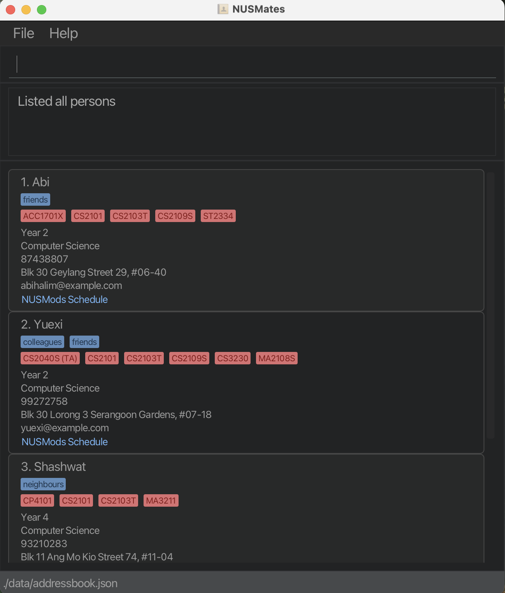
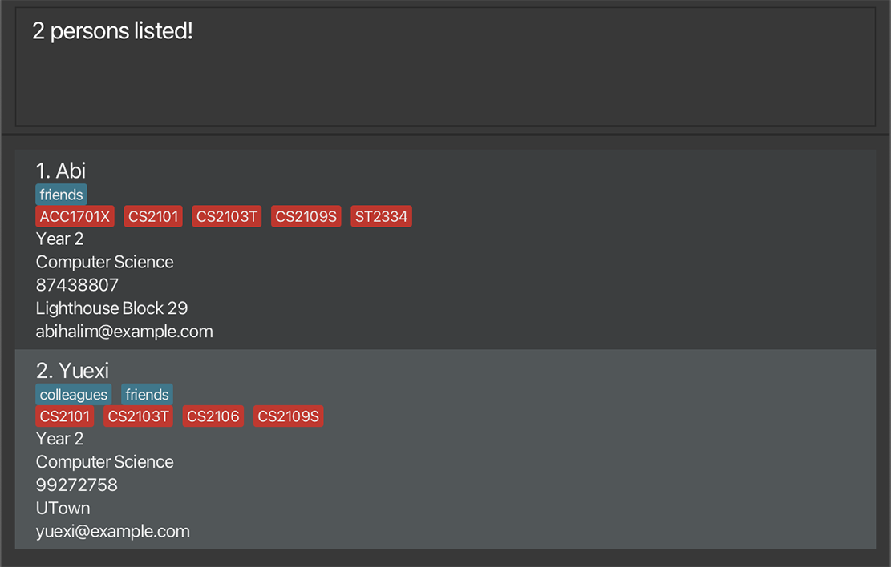

# NUSMates User Guide

NUSMates allows NUS undergraduate students to record the contact details of their fellow NUS undergraduate students. With NUSMates, you can record NUS-specific contact information such as [year](#year), [major](#major), housing, and [modules](#module). 
NUSMates also makes it seamless to record [module](#module) information using [NUSMods link](#nusmods), helping you easily find friends who are taking the same [modules](#module) - so you can form project groups, share notes, or know who to reach out to for help.

> 💡 You can quickly look up all commands in the [Command Summary](#command-summary), or check the [Glossary](#glossary) if you’re unsure about any technical terms used.

--------------------------------------------------------------------------------------------------------------------

## Table of Contents
1. [Quick Start](#quick-start)
2. [Command Summary](#command-summary)
3. [Features](#features)
    1. [Adding a contact: `add`](#adding-a-person-add)
    2. [Editing a contact: `edit`](#editing-a-person--edit)
    3. [Deleting a contact: `delete`](#deleting-a-person--delete)
    4. [Finding a contact by name: `find`](#locating-persons-by-name-find)
    5. [Finding a contact by modules: `findMod`](#locating-persons-by-module-findmod)
    6. [Listing all contacts: `list`](#listing-all-persons--list)
    7. [Clearing all contacts: `clear`](#clearing-all-entries--clear)
    8. [Exiting the app: `exit`](#exiting-the-program--exit)
    9. [Viewing help: `help`](#viewing-help--help)
   10. [Saving and editing the data file](#saving-and-editing-the-data-file)
4. [How to get the NUSMods link](#how-to-get-the-nusmods-link)
5. [Detailed installation guide](#detailed-installation-guide)
6. [Troubleshooting](#troubleshooting)
7. [Glossary](#glossary)

--------------------------------------------------------------------------------------------------------------------

## Quick Start 
> ⚠️ Having trouble installing the app or confused by any of the steps? Check out the [Detailed Installation Guide](#detailed-installation-guide) for step-by-step help.

1. Make sure you have **[Java](#java) 17 or later** installed in your computer. 
   ⚠️ **Mac users:** Ensure you have the precise JDK version prescribed [here](https://se-education.org/guides/tutorials/javaInstallationMac.html).

2. Download the latest `[.jar file](#jar-file)` from [here](#https://github.com/AY2425S2-CS2103T-T11-1/tp/releases).

3. Copy the file to the [home folder](#home-folder) you want to use as the [home folder](#home-folder) for NUSMates. NUSMates will later generate files in this folder, including save data.

4. Open a [terminal](#terminal) and `cd` into the folder you put the `[.jar file](#jar-file)` in.

5. Use the command `java -jar nusmates.jar` to run the application. 
   A [GUI](#gui) similar to the below should appear in a few seconds. Note how the app contains some sample data. 
   

6. Type the command in the command box and press Enter to execute it.  
   💡 Some example commands you can try:

   * `list` : Lists all contacts.

   * `add n/John Doe y/2 m/Computer Science` : Adds a contact named `John Doe` to NUSMates.

   * `delete 3` : Deletes the 3rd contact shown in the current list.

   * `clear` : Deletes all contacts.

   * `exit` : Exits the app.

7. Refer to the [Features](#features) below for details of each command.

--------------------------------------------------------------------------------------------------------------------

## Command Summary
💡 For more detailed information regarding the command format and each command, refer to the [Features](#features) section.

| Command     | Format, Examples                                                                                                                                                                                                                                                                 |
|-------------|----------------------------------------------------------------------------------------------------------------------------------------------------------------------------------------------------------------------------------------------------------------------------------|
| **Add**     | `add n/NAME p/PHONE_NUMBER e/EMAIL y/YEAR m/MAJOR h/HOUSING l/[NUSMods link](#nusmods) t/[tag](#tag)…​`   e.g., `add n/John Doe p/98765432 e/johnd@example.com y/2 m/Computer Science  h/UTown Residence l/https://nusmods.com/timetable/sem-2/share?CS2103T=LEC:G12 t/kiasu` |
| **Edit**    | `edit [index](#index) n/NAME p/PHONE_NUMBER e/EMAIL y/YEAR m/MAJOR h/HOUSING l/[NUSMods link](#nusmods) t/[tag](#tag)…​`  e.g.,`edit 2 n/James Lee e/jameslee@example.com`                                                                                                    |
| **Delete**  | `delete [index](#index)`  e.g., `delete 3`                                                                                                                                                                                                                                    |
| **Find**    | `find KEYWORD...`  e.g., `find James Jake`                                                                                                                                                                                                                                    |
| **FindMod** | `findMod KEYWORD...`  e.g., `findMod CS2103T CS2101`                                                                                                                                                                                                                          |
| **List**    | `list`                                                                                                                                                                                                                                                                           |
| **Clear**   | `clear`                                                                                                                                                                                                                                                                          |
| **Exit**    | `exit`                                                                                                                                                                                                                                                                           |
| **Help**    | `help`                                                                                                                                                                                                                                                                           |

--------------------------------------------------------------------------------------------------------------------

## Features

> 💡 Notes about the command format:
> 
> * Words in `UPPER_CASE` are the [parameters](#parameter) you must supply when entering the command. 
  e.g. in `add n/NAME`, `NAME` is a [parameter](#parameter) which can be used as `add n/John Doe`.
>
> * Items with `…`​ after them can be used multiple times including zero times. 
  e.g. `[t/[tag](#tag)]…​` can be used as ` ` (i.e. 0 times), `t/friend`, `t/friend t/family` etc.
> 
> * [Parameters](#parameter) can be in any order. 
  e.g. if the command specifies `n/NAME p/PHONE_NUMBER`, `p/PHONE_NUMBER n/NAME` is also acceptable.
> 
> * ⚠️ If you are using a PDF version of this document, be careful when copying and pasting commands that span multiple lines as space characters surrounding line-breaks may be omitted when copied over to the application.

### Adding a person: `add`

Adds a person to NUSMates.

Format: `add n/NAME p/PHONE_NUMBER e/EMAIL y/YEAR m/MAJOR h/HOUSING l/[NUSMods link](#nusmods) t/[tag](#tag)…​`

* All parameters **except for `NAME`** are optional. 
e.g. You can add a contact with only name, [year](#year), and [major](#major) using `add n/John Doe y/2 m/Computer Science` 
* A person can have any number of **[tags](#tag)**, including none. 
* `LINK` refers to the student's [NUSMods link](#nusmods) course schedule original link.

Examples:
* `add n/John Doe p/98765432 e/johnd@example.com y/2 m/Computer Science  h/UTown Residence l/https://nusmods.com/timetable/sem-2/share?CS2103T=LEC:G12`
* `add n/Betsy Crowe t/friend e/betsycrowe@example.com y/1 m/Electrical Engineering h/PGPR p/1234567 l/https://nusmods.com/timetable/sem-2/share?CS2040=TUT:12,LAB:06,LEC:1`

> 💡For details on the NUSMods link parameter and how to get it, go to [How to get the NUSMods link](#how-to-get-the-nusmods-link)

###
### Editing a person : `edit`

Edits an existing person in NUSMates.

Format: `edit [index](#index) n/NAME p/PHONE e/EMAIL y/YEAR m/MAJOR h/HOUSING l/[NUSMods link](#nusmods) t/[tag](#tag)…​`

* `[Index](#index)` refers to the [index](#index) number shown in the displayed person list. The [index](#index) **must be a positive integer** 1, 2, 3, …​
* At least one of the [parameters](#parameter) must be provided.
* Existing values will be updated to the input values.
* For all fields except `name`, you can set it to nothing by typing the prefix without anything following it.  
e.g. You can remove all the person’s [tags](#tag) by typing `t/` without specifying any [tags](#tag) after it.
* When editing [tags](#tag), the existing [tags](#tag) of the person will be removed i.e adding of [tags](#tag) is not cumulative.

Examples:
*  `edit 1 p/91234567 e/johndoe@example.com` Edits the phone number and email address of the 1st person to be `91234567` and `johndoe@example.com` respectively.
*  `edit 2 n/Betsy Crower t/` Edits the name of the 2nd person to be `Betsy Crower` and clears all existing [tags](#tag).

###
### Deleting a person : `delete`

Deletes the specified person from the address book.

Format: `delete [index](#index)`

* Deletes the person at the specified `[index](#index)`.
* The [index](#index) refers to the [index](#index) number shown in the displayed person list.
* The [index](#index) **must be a positive integer** 1, 2, 3, …​

Examples:
* `list` followed by `delete 2` deletes the 2nd person in the address book.
* `find Betsy` followed by `delete 1` deletes the 1st person in the results of the `find` command.

###
### Locating persons by name: `find`

Finds persons whose names contain any of the given keywords.

Format: `find KEYWORD [MORE_KEYWORDS]`

* The search is case-insensitive. e.g `hans` will match `Hans`
* The order of the keywords does not matter. e.g. `Hans Bo` will match `Bo Hans`
* Only the name is searched.
* Only full words will be matched e.g. `Han` will not match `Hans`
* Persons matching at least one keyword will be returned (i.e. `OR` search).
  e.g. `Hans Bo` will return `Hans Gruber`, `Bo Yang`

Examples:
* `find John` returns `John Doe`
* `find alex david` returns `Alex Yeoh`, `David Li` 
  

###
### Locating persons by [module](#module): `findMod`

Finds persons who's [NUSMods link](#nusmods) contains any of the given [modules](#module).

Format: `findMod KEYWORD [MORE_KEYWORDS]`

* The search is case-insensitive. e.g `cs2030` will match `CS2030`
* The order of the keywords does not matter. e.g. `CS2030 CS2103T` will match `CS2103T CS2030`
* Only the [module](#module) is searched.
* Only full words will be matched e.g. `CS2103` will not match `CS2103T`
* Persons matching at least one of the [modules](#module) searched will be returned (i.e. `OR` search).

Examples:
* `findMod CS2109S` returns `Abi, Yuexi`
  

###
### Listing all persons : `list`

Shows a list of all persons in the address book.

Format: `list`

###
### Clearing all entries : `clear`

Clears all entries from the address book.

Format: `clear`

###
### Exiting the program : `exit`

Exits the program.

Format: `exit`

###
### Viewing help : `help`

Shows a message explaining how to access the help page.

Format: `help`

### Saving and editing the data [file](#json-file)

NUSMates data is saved in the hard disk automatically after any command that changes the data. There is no need to save manually.

NUSMates data is saved automatically as a [JSON file](#json-file) `[JAR file location]/data/addressbook.json`. Advanced users are welcome to update data directly by editing that data [file](#json-file).

>⚠️ **Caution:**  
> If your changes to the data [file](#json-file) makes its format invalid, AddressBook will discard all data and start with an empty data [file](#json-file) at the next run. Hence, it is recommended to take a backup of the [file](#json-file) before editing it. 
> Furthermore, certain edits can cause the AddressBook to behave in unexpected ways (e.g., if a value entered is outside of the acceptable range). Therefore, edit the data [file](#json-file) only if you are confident that you can update it correctly.

--------------------------------------------------------------------------------------------------------------------

## How to get the NUSMods Link

#TODO

--------------------------------------------------------------------------------------------------------------------

## Detailed Installation Guide

#TODO

--------------------------------------------------------------------------------------------------------------------

## Troubleshooting

1. **When using multiple screens**, if you move the application to a secondary screen, and later switch to using only the primary screen, the [GUI](#gui) will open off-screen. The remedy is to delete the `preferences.json` [file](#json-file) created by the application before running the application again.
2. **If you minimize the Help Window** and then run the `help` command (or use the `Help` menu, or the keyboard shortcut `F1`) again, the original Help Window will remain minimized, and no new Help Window will appear. The remedy is to manually restore the minimized Help Window.
3. **To transfer your data to another computer,** install the app in the other computer and overwrite the empty data [file](#json-file) it creates with the [file](#json-file) that contains the data of your previous AddressBook [home folder](#home-folder).

--------------------------------------------------------------------------------------------------------------------

## Glossary
Here are the definitions of some uncommon or domain-specific terms used frequently in this user guide.

### Java
A programming language and platform used to run NUSMates. You need Java 17 or above installed on your computer to run the `.jar` file.

### .jar file
A Java Archive file that packages a Java application. You run it using the `java -jar` command.

### Terminal
A text-based interface that allows users to interact with the computer using commands. On Windows, this is called the Command Prompt; on macOS, it’s called Terminal.

### cd command
Short for “change directory.” This command is used in the terminal to navigate to the folder where your `.jar` file is located.

### Home folder
The folder where you place the `.jar` file. NUSMates stores its data in this folder.

### GUI
Short for Graphical User Interface. It’s the visual interface of the app with windows and buttons.

### Parameter
A specific piece of information the user provides when entering a command. Parameters are usually written in `UPPER_CASE` in the command format.

### Index
A number that represents the position of a contact in the list shown in the app. For example, the first contact has index 1.

### Tag
A label you can add to a contact to help categorise them, e.g. `t/friend` or `t/project`.

### JSON file
A type of file used to store data in a structured format. NUSMates uses a JSON file to save your contact data.

### NUSMods
A website used by NUS students to view and plan their module timetables. NUSMates uses NUSMods links to associate contacts with their class schedules.

### Module
A subject or course that NUS students take as part of their degree programme. Each module has a unique code (e.g., CS2103T) and typically includes lectures, tutorials, and/or labs.

### Major
The primary field of study that a student is specialising in at NUS, such as Computer Science or Electrical Engineering.

### Year
Refers to the student's current year of study at NUS, e.g., Year 1 (first-year student), Year 2, and so on.
