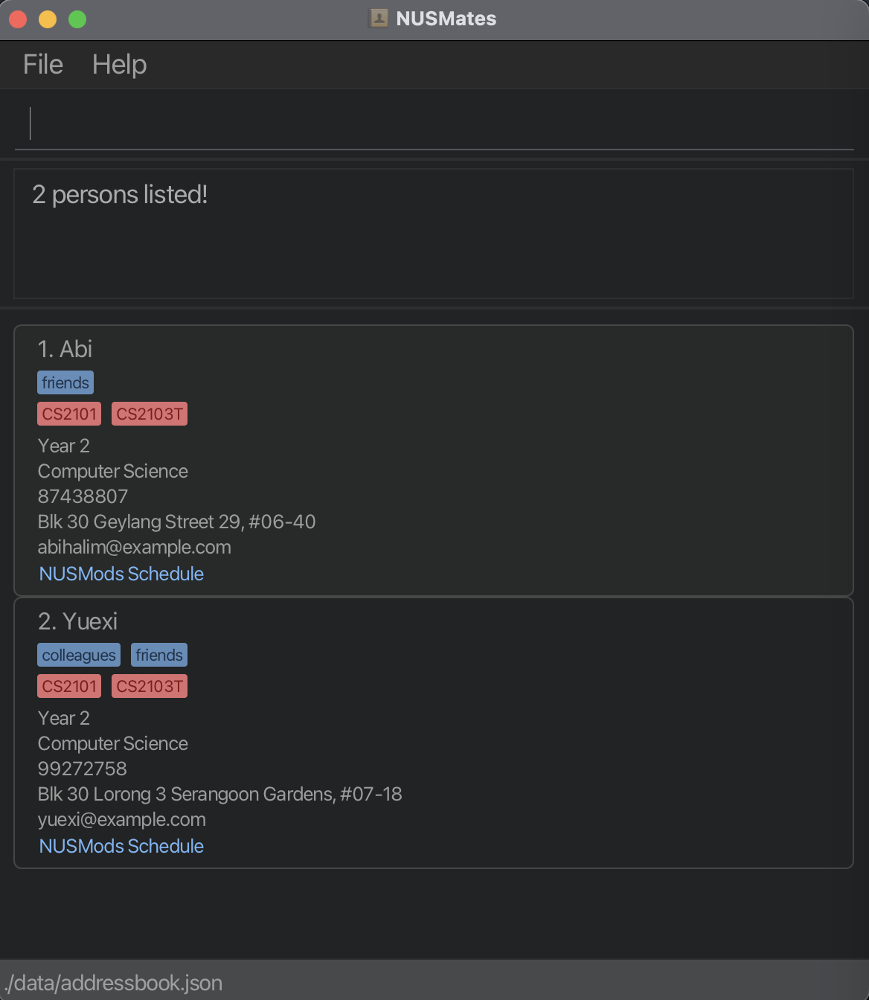

# NUSMates User Guide
{: .no_toc}

NUSMates allows NUS undergraduate students to record the contact details of their fellow NUS undergraduate students. With NUSMates, you can record NUS-specific contact information such as [year](#year), [major](#major), [housing](#housing), and [modules](#module).
NUSMates makes it seamless for you to record [module](#module) information using an [NUSMods link](#nusmods-link), helping you easily find friends who are taking the same [modules](#module) - so you can form project groups, share notes, or know who to reach out to for help.

#### You will love NUSMates if:
{: .no_toc}

* You're an NUS undergraduate student who frequently uses NUSMods
* You're socially active in NUS with a need to manage the contacts of your fellow NUS undergraduate students
* You often use NUSMods to plan, record, and share your course schedules
* You're tech-savvy and familiar with installing jar files
* You can type fast and prefer typing commands over using a mouse

{: .tip }
> You can quickly look up all commands in the [Command Summary](#command-summary), or check the [Glossary](#glossary) if you’re unsure about any technical terms used.

--------------------------------------------------------------------------------------------------------------------

## Table of Contents
{: .no_toc .text-delta }

1. Table of Contents
{:toc}

--------------------------------------------------------------------------------------------------------------------

## Quick Start

{: .tip }
> Having trouble installing the app or confused by any of the steps? Check out the [Detailed Installation Guide](#detailed-installation-guide) for step-by-step help.

1. Make sure you have **[Java](#java) 17 or later** installed in your computer.<br>
   > {: .note }
   > **Mac users:** Ensure you have the precise JDK version prescribed [here](https://se-education.org/guides/tutorials/javaInstallationMac.html).

2. Download the latest [.jar file](#jar-file) from [here](https://github.com/{{site.repository}}/releases).

3. Copy the file to the [home folder](#home-folder) you want to use as the [home folder](#home-folder) for NUSMates. NUSMates will later generate files in this folder, including save data.

4. Open a [terminal](#terminal) and `cd` into the folder you put the `[.jar file]` in.

5. Use the command `java -jar "nusmates.jar"` to run the application.
   A [GUI](#gui) similar to the below should appear in a few seconds. Note how the app contains some sample data.<br>
   
|                                     |
|:--------------------------------------------------------------:|
|    GUI which should appear after you launch the application    |
    

6. Type the command in the command box and press Enter to execute it.
7. Refer to the [Features](#features) below for details of each command.

--------------------------------------------------------------------------------------------------------------------
## Command Summary

{: .note }
> For more detailed information regarding the command format and each command, refer to the [Features](#features) section.

| Command     | Format, Examples                                                                                                                                                                                                                                                                          |
|-------------|-------------------------------------------------------------------------------------------------------------------------------------------------------------------------------------------------------------------------------------------------------------------------------------------|
| **Add**     | `add n/NAME [p/PHONE_NUMBER] [e/EMAIL] [y/YEAR] [m/MAJOR] [h/HOUSING] [l/NUSMODS_LINK] [t/TAG] [t/MORE_TAGS]...` <br> e.g., `add n/John Doe p/98765432 e/johnd@example.com y/2 m/Computer Science  h/UTown Residence l/https://nusmods.com/timetable/sem-2/share?CS2103T=LEC:G12 t/kiasu` |
| **Edit**    | `edit index [n/NAME] [p/PHONE_NUMBER] [e/EMAIL] [y/YEAR] [m/MAJOR] [h/HOUSING] [l/NUSMODS_LINK] [t/TAG]...`<br> e.g.,`edit 2 n/James Lee e/jameslee@example.com`                                                                                                                          |
| **Delete**  | `delete index`<br> e.g., `delete 3`                                                                                                                                                                                                                                                       |
| **Find**    | `find KEYWORD [MORE_KEYWORDS]...`<br> e.g., `find James Jake`                                                                                                                                                                                                                             |
| **FindMod** | `findMod KEYWORD [MORE_KEYWORDS]...`<br> e.g., `findMod CS2103T CS2101`                                                                                                                                                                                                                   |
| **List**    | `list`                                                                                                                                                                                                                                                                                    |
| **Clear**   | `clear`                                                                                                                                                                                                                                                                                   |
| **Exit**    | `exit`                                                                                                                                                                                                                                                                                    |
| **Help**    | `help`                                                                                                                                                                                                                                                                                    |

--------------------------------------------------------------------------------------------------------------------

## Storing a contact

This section explains the meaning of each contact field you can include when storing a contact. These fields are also used as parameters in some commands.


| Field            | Explanation                                                                                                                                                                                    | Constraints                                                                     |
|------------------|------------------------------------------------------------------------------------------------------------------------------------------------------------------------------------------------|---------------------------------------------------------------------------------|
| `n/NAME`         | The name of the person. This is the only required field.                                                                                                                                       | A non-empty string consisting of alphanumeric characters and spaces.            | 
| `p/PHONE_NUMBER` | The person’s phone number.                                                                                                                                                                     | **8-digit number**, as all target users are expected to be Singapore residents. |
| `e/EMAIL`        | The person’s email address.                                                                                                                                                                    | Any valid email address.                                                        |
| `y/YEAR`         | The person’s [year](#year) of study at NUS. E.g., `1` = Year 1.<br/>                                                                                                                           | Any number between 1 to 6, which is the maximum candidature period.             |
| `m/MAJOR`        | The person’s [major](#major) at NUS. E.g., Computer Science.                                                                                                                                   | Any string.                                                                     |
| `h/HOUSING`      | Where the person stays, such as UTown Residence or off-campus.                                                                                                                                 | Any string.                                                                     |
| `l/NUSMODS_LINK` | A link to the person’s [NUSMods](#nusmods-link) timetable containing the modules they are taking. You can click the link to copy it to your clipboard.                                         | Any valid NUSMods timetable link.                                               |
| `t/TAG`          | [Tags](#tag) to categorise the person, e.g., `t/friend`, `t/project`. One person can have multiple tags.<br/>💡 Tip: You can use tags to record CCAs, country of origin, etc. | Any alphanumeric string.                                                        |

--------------------------------------------------------------------------------------------------------------------

## Features

{: .note }
> * Words in `UPPER_CASE` are the [parameters](#parameter) you must supply when entering the command.<br>
  e.g. in `add n/NAME`, `NAME` is a [parameter](#parameter) which can be used as `add n/John Doe`.
> * Items with `…`​ after them can be used multiple times including zero times.<br>
    e.g. `[t/tag]...` can be used as ` ` (i.e. 0 times), `t/friend`, `t/friend t/family` etc.
> * Extraneous parameters for commands that do not take in parameters (such as `list`, `clear`, `exit` and `help`) will be ignored.
    e.g. if the command specifies `list 123`, it will be interpreted as `list`.

{: .tip }
> * [Parameters](#parameter) can be in any order.<br>
  e.g. if the command specifies `n/NAME p/PHONE_NUMBER`, `p/PHONE_NUMBER n/NAME` is also acceptable.
> * ⚠️ If you are using a PDF version of this document, be careful when copying and pasting commands that span multiple lines as space characters surrounding line-breaks may be omitted when copied over to the application.

### Adding a person: `add`

You can add a person to NUSMates and record their contact information with the `add` command.

Format: `add n/NAME [p/PHONE_NUMBER] [e/EMAIL] [y/YEAR] [m/MAJOR] [h/HOUSING] [l/NUSMODS_LINK] [t/TAG] [t/MORE_TAGS]...`

* All parameters **except for `NAME`** are optional.<br>
e.g. You can add a contact with only name, [year](#year), and [major](#major) using `add n/John Doe y/2 m/Computer Science`<br>
* A person can have any number of [tags](#tag), including none.<br>
* `NUSMODS_LINK` refers to the student's [NUSMods link](#nusmods-link) course schedule original link.

Examples:
* `add n/John Doe p/98765432 e/johnd@example.com y/2 m/Computer Science  h/UTown Residence l/https://nusmods.com/timetable/sem-2/share?CS2103T=LEC:G12`
* `add n/Betsy Crowe t/friend e/betsycrowe@example.com y/1 m/Electrical Engineering h/PGPR p/1234567 l/https://nusmods.com/timetable/sem-2/share?CS2040=TUT:12,LAB:06,LEC:1`

{: .note }
> The application does not allow for two contacts to have the same name! However, other fields may have duplicates. 

{: .tip }
> For details on the NUSMods link parameter and how to get it, read [here](#how-to-get-the-nusmods-link)

### Editing a person : `edit`

You can edit the details of a person whose contact information you already saved with the `edit` command.

Format: `edit index [n/NAME] [p/PHONE_NUMBER] [e/EMAIL] [y/YEAR] [m/MAJOR] [h/HOUSING] [l/NUSMODS_LINK] [t/TAG]...`

* `Index` refers to the [index](#index) number shown in the displayed person list. The [index](#index) **must be a positive integer** 1, 2, 3, …​
* **At least one of the [parameters](#parameter) must be provided.**
* Existing values will be updated to the input values.
* You can remove all the person’s [tags](#tag) by typing `t/` without specifying any [tags](#tag) after it.
* When editing [tags](#tag), the existing [tags](#tag) of the person will be removed i.e adding of [tags](#tag) is not cumulative.

{: .warning }
> You cannot combine tag clearing `t/` and tag addition `t/TAG` in the same command. Doing so will result in an error.
> For example, the command `edit 1 t/ t/friends` is invalid — you must either clear all tags `t/` or replace them with new tags `t/friends t/groupmate`, but not both.

Examples:
*  `edit 1 p/91234567 e/johndoe@example.com` Edits the phone number and email address of the 1st person to be `91234567` and `johndoe@example.com` respectively.
*  `edit 2 n/Betsy Crower t/` Edits the name of the 2nd person to be `Betsy Crower` and clears all existing [tags](#tag).

### Deleting a person : `delete`

You can delete a person from NUSMates with the `delete` command.

Format: `delete index`

* Deletes the person at the specified `index`.
* The [index](#index) refers to the [index](#index) number shown in the displayed person list.
* The [index](#index) **must be a positive integer** 1, 2, 3, …​

Examples:
* `list` followed by `delete 2` deletes the 2nd person in the address book.
* `find Betsy` followed by `delete 1` deletes the 1st person in the results of the `find` command.

### Locating persons by name: `find`

You can find a person in your contacts whose name matches a keyword with the `find` command.

Format: `find KEYWORD [MORE_KEYWORDS]...`

* The search is case-insensitive. e.g `hans` will match `Hans`
* You can use multiple keywords separated by spaces, e.g. `Hans Bo`
* The order of the keywords does not matter. e.g. `Hans Bo` will match `Bo Hans`
* Only the name is searched.
* Only full words will be matched e.g. `Han` will not match `Hans`
* Persons matching at least one keyword will be returned (i.e. `OR` search).
  e.g. `Hans Bo` will return `Hans Gruber`, `Bo Yang`

Examples:
* `find Huazhi` returns `Huazhi`
* `find Abi Yuexi` returns `Abi`, `Yuexi`<br>

|  |
|:---------------------------------------------------:|
|             Result for `find Abi Yuexi`             |

### Locating persons by [module](#module): `findMod`

You can find a person taking certain [modules](#module) with the `findMod` command.

Format: `findMod KEYWORD [MOREKEYWORDS]...`

* The search is case-insensitive. e.g `cs2030` will match `CS2030`
* The order of the keywords does not matter. e.g. `CS2030 CS2103T` will match `CS2103T CS2030`
* Only the [module](#module) is searched.
* Only full words will be matched e.g. `CS2103` will not match `CS2103T`
* Persons matching at least one of the [modules](#module) searched will be returned (i.e. `OR` search).
* Note that NUSMates can distinguish between modules added as student or as a TA on NUSMods. Modules with the TA option enabled are appended with a `(TA)`, so `CS2030` would become `CS2030(TA)` instead.

Examples:
* `findMod CS2109S` returns `Abi, Yuexi`

|  |
|:-------------------------------------------------------:|
|              Result for `findMod CS2109S`               |

### Listing all persons : `list`

After finding specific persons, you can list all your contacts again with the `list` command.

Format: `list`

### Clearing all entries : `clear`

You can quickly delete all your contacts with the `clear` command.

Format: `clear`


{: .warning }
> There is no way to undo clearing all your contacts, so be careful!

### Exiting the program : `exit`

You can exit the NUSMates app by using the `exit` command.

Format: `exit`

### Viewing help : `help`

You can return to this user guide for help on using NUSMates by using the `help` command.

|                    |
|:---------------------------------------------------------:|
| Pop-up window displayed when you enter the `help` command |

Format: `help`

### Saving and editing the data [file](#json-file)

NUSMates data is saved in the hard disk automatically after any command that changes the data, so you don't need to save manually.

NUSMates data is saved automatically as a [JSON file](#json-file) `[JAR file location]/data/addressbook.json`. If you are an advanced user, you are welcome to update data directly by editing that file.

{: .warning }
> If your changes to the data file makes its format invalid, NUSMates will discard all data and start with an empty data file at the next run. Hence, it is recommended to take a backup of the data file before editing it.<br>
> Furthermore, certain edits can cause NUSMates to behave in unexpected ways (e.g., if a value entered is outside of the acceptable range). Therefore, edit the data file only if you are confident that you can update it correctly.

--------------------------------------------------------------------------------------------------------------------

## How to get the NUSMods Link

{: .note-title }
> ℹ️ Note: What is NUSMods?
>
> NUSMods is a website used by NUS students to view and plan their module timetables. A typical NUSMods timetable might look something like this:

>You can share your NUSMods timetable with others using an NUSMods link. NUSMates uses this NUSMods link to record the module information of a contact.

### Step 1: Share/Sync
{: .no_toc}
Click on the `Share/Sync` button on the top right.

|  |
|:----------------------------------------------:|
|    `Share/Sync` button on the NUSMods website    |

### Step 2: Show original link
{: .no_toc}
Click on the `Show original link` button to convert the shortened NUSMods link to the original one.

|      |
|:--------------------------------------------------:|
| `Show original link` button on the NUSMods website |

### Step 3. Copy
{: .no_toc}
Copy the link, and you're done!

|  |
|:----------------------------------------------:|
|   `Copy link` button on the NUSMods website    |

You can now use this link as the `l/NUSMODS_LINK` parameter in the [add](#adding-a-person-add) or [edit](#editing-a-person--edit) commands.

--------------------------------------------------------------------------------------------------------------------

## Detailed Installation Guide

This section helps you install and run NUSMates, even if you have never used a [terminal](#terminal) or heard of [Java](#java) before. Just follow the steps one by one!


### Step 1: Check if you already have Java
{: .no_toc}

NUSMates runs using [Java](#java), which is a common tool installed on many computers.

#### To check:
{: .no_toc}

1. Open your [terminal](#terminal):
   - On **Windows**: Press the `Windows` key, type `cmd`, and press Enter.
   - On **macOS**: Press `Cmd + Space`, type `Terminal`, and hit Enter.

2. Type this into the terminal and press Enter:
   ```
   java -version
   ```

3. If you see a version number that starts with `17` or higher, such as in the image below, you’re good to go. Move to step 2.

|                                                  |
|:----------------------------------------------------------------------------------------------:|
| Result of entering the `java -version` command in terminal, and where to see your Java version |

4. If you see an error, or a number less than 17, you’ll need to install Java. Follow the guide for your operating system below:

   - [Java Installation Guide (Windows & macOS)](https://se-education.org/guides/tutorials/javaInstallation.html)


### Step 2: Download the NUSMates `.jar` file
{: .no_toc}

1. Go to the latest release of NUSMates on the [NUSMates releases page](https://github.com/AY2425S2-CS2103T-T11-1/tp/releases/)

2. Find the most recent version, and download the file named `nusmates.jar`


### Step 3: Choose a [home folder](#home-folder)
{: .no_toc}

1. Create a new folder anywhere you like, e.g., on your `Desktop` or in `Documents`.
2. Give it a name like `NUSMates`.
3. Move the downloaded `.jar` file into this folder.


### Step 4: Open the [terminal](#terminal) in that folder
{: .no_toc}

You’ll now “go into” the folder using the terminal.

#### On Windows:
{: .no_toc}

1. Open **File Explorer** and navigate to your NUSMates folder.
2. In the address bar at the top, type `cmd` and press Enter.
3. A [terminal](#terminal) window will appear, already inside the folder.

#### On macOS:
{: .no_toc}

1. Open the **Terminal** app.
2. Type `cd ` (with a space), then drag and drop your NUSMates folder into the terminal.
3. Press Enter.

### Step 5: Run NUSMates
{: .no_toc}

Now that you’re in the correct folder, run this command:

```
java -jar nusmates.jar
```

If everything works, a window will pop up showing NUSMates with some sample contacts, such as below.

|                                     |
|:--------------------------------------------------------------:|
|    GUI which should appear after you launch the application    |

{: .warning }
> If you see an error:
>   - Double-check that you're in the correct folder and that the file name is exactly `nusmates.jar`.
>   - Make sure [Java](#java) was installed properly.
>   - Visit the [Troubleshooting](#troubleshooting) section for more help.

--------------------------------------------------------------------------------------------------------------------

## FAQ

**Q**: How do I transfer my data to another Computer?<br>
**A**: Install the app in the other computer and overwrite the empty data [file](#json-file) it creates with the [file](#json-file) that contains the data of your previous AddressBook [home folder](#home-folder).

**Q**:  Can I use NUSMates on my mobile device?<br>
**A**: NUSMates is a command-line application that may not be optimized for mobile devices.
It’s best used on desktop environments where a terminal or command prompt is available.

**Q**: How do I get the NUSMods link?<br>
**A**: You may refer to the detailed step-by-step guide [here](#how-to-get-the-nusmods-link).

**Q**: Can I add two contacts with the same name?<br>
**A**: No, NUSMates does not allow duplicate names when adding contacts.
Each contact must have a unique name in the system.
To add multiple people with the same name, distinguish them in some way such as adding a descriptor (e.g., John Doe (Work)) or a number (Amy1, Amy2).

**Q**: Can I edit a contact's module information manually?<br>
**A**: No, a contact's module information is automatically retrieved from the NUSMods link they provided.
If their schedule changes, simply ask them to send you the updated link, and you can update their module information using the [edit](#editing-a-person--edit) command.

**Q**: If my contact changes their schedule on NUSMods, will their modules be automatically updated in NUSMates?<br>
**A**: No, changes in NUSMods will not automatically be reflected in NUSMates. You can ask your contact to send you the updated link, and you can update their module information using the [edit](#editing-a-person--edit) command.

**Q**: How are hidden modules in the timetable treated?<br>
**A**: Our link processing treats hidden modules as usual, and **does** add it to the module list of the contact.

--------------------------------------------------------------------------------------------------------------------

## Troubleshooting

1. **When using multiple screens**, if you move the application to a secondary screen, and later switch to using only the primary screen, the [GUI](#gui) will open off-screen. The remedy is to delete the `preferences.json` [file](#json-file) created by the application before running the application again.
2. **If you minimize the Help Window** and then run the `help` command (or use the `Help` menu, or the keyboard shortcut `F1`) again, the original Help Window will remain minimized, and no new Help Window will appear. The remedy is to manually restore the minimized Help Window.

--------------------------------------------------------------------------------------------------------------------

## Glossary
Here are the definitions of some uncommon or domain-specific terms used frequently in this user guide.

### Java
{: .no_toc}
A programming language and platform used to run NUSMates. You need Java 17 or above installed on your computer to run the `.jar` file.

### `.jar` file
{: .no_toc}
A Java Archive file that packages a Java application. You run it using the `java -jar` command.

### Terminal
{: .no_toc}
A text-based interface that allows users to interact with the computer using commands. On Windows, this is called the Command Prompt; on macOS, it’s called Terminal.

### `cd` command
{: .no_toc}
Short for “change directory.” This command is used in the terminal to navigate to the folder where your `.jar` file is located.

### Home folder
{: .no_toc}
The folder where you place the `.jar` file. NUSMates stores its data in this folder.

### GUI
{: .no_toc}
Short for Graphical User Interface. It’s the visual interface of the app with windows and buttons.

### Parameter
{: .no_toc}
A specific piece of information the user provides when entering a command. Parameters are usually written in `UPPER_CASE` in the command format.

### Index
{: .no_toc}
A number that represents the position of a contact in the list shown in the app. For example, the first contact has index 1.

### Tag
{: .no_toc}
A label you can add to a contact to help categorise them, such as storing CCA information e.g. `t/NUS Amplified` or `t/NUS Computing Club`.

### JSON file
{: .no_toc}
A type of file used to store data in a structured format. NUSMates uses a JSON file to save your contact data.

### NUSMods Link
{: .no_toc}
NUSMods is a website used by NUS students to view and plan their module timetables. You can share your NUSMods timetable using an NUSMods link. For more information, refer to [how to get the NUSMods link](#how-to-get-the-nusmods-link).

### Module
{: .no_toc}
A subject or course that NUS students take as part of their degree programme. Each module has a unique code (e.g., CS2103T) and typically includes lectures, tutorials, and/or labs.

### Major
{: .no_toc}
The primary field of study that a student is specialising in at NUS, such as Computer Science or Electrical Engineering.

### Year
{: .no_toc}
Refers to the student's current year of study at NUS, e.g., Year 1 (first-year student), Year 2, and so on.

### Housing
{: .no_toc}
Refers to the student's housing option at NUS or where they live in general such as UTown Residence, Lighthouse, or their address off campus.
